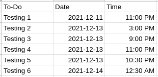

# Raspberry Pi Phone Notification Script

This script allows me to send notifications to my phone through the [Pushover](https://www.pushover.net) service whenever an event occurs.

## Setup
1. Create an account on Pushover (a one time purchase of $5 is required)
2. Replace token and user with Pushover application token and user token
3. Set the script as an executable `chmod +x script.py`
4. Create a cron job with crontab to run the script
    - Run `crontab -e` to get into crontab editor
    - Enter `*/30 * * * * path/to/script/script.py` on a new line. This will make the script run every 30 minutes. My preferred interval is 30, so if you change it make sure to change the 30 in `if (((datetime.datetime.now().hour - time,hour)*60) + (datetime.datetime.now().minute - time.minute)) < 30:` for best results
5. Read the `ToDo Notification` section

## ToDo Notification
The sleep notification and the temperature notification functions are pretty simple, but the todo notification needs some clarification. My goal with the todo notification function was to make the program download a copy or retrieve the data from an online excel/spreadsheet file - which would contain all my events, dates, and times - that I edited from any device and then notify me whenever I have some event coming up. I tried to do this with Office 365, but using the sharepoint api was too complicated. I then tried to use Google Drive's api, but that was overly complicated as well. I finally just settled on publishing the excel file to the web - which just means allowing anyone who has the link to download the file (to achieve this simply go to File > Share > Publish To Web > Link and choose the format that you want to share it as. I chose .xlsx because it's the easiest to work with) - and worked with that. When setting up your spreadsheet, make sure to use this format. Make 3 columns, one for the `To-Do`, `Date`, and `Time`. The `To-Do` can be any string, the `Date` has to be in the format `yyyy-mm-dd` (make sure to use the `Format > Number > Custom Date and Time` tab on google sheets to do this), and the `Time` has to be `hh:mm AM/PM`
```
To-Do	    Date	    Time
Testing 1	2022-01-20	11:58 AM
Testing 2	2022-01-20	11:58 AM
```

## To-Do List Template
- The To-Do list should be in this form:

